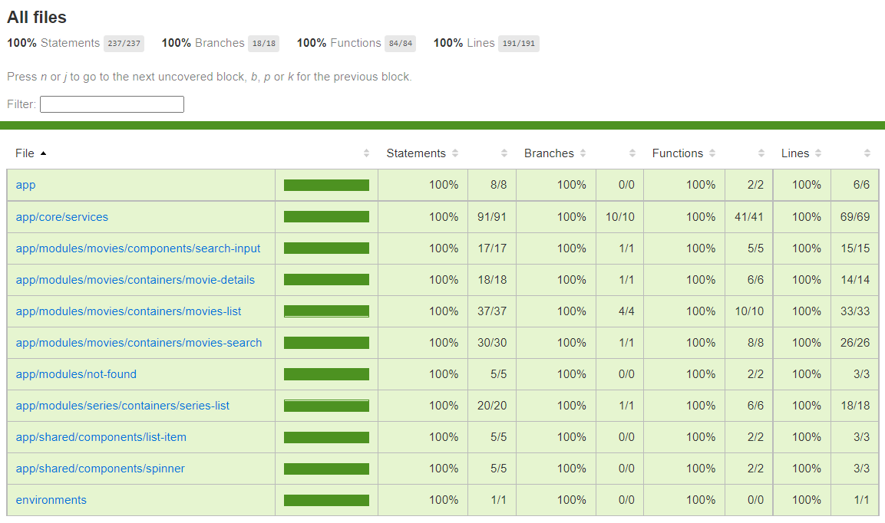

# Movies List

This project was built using Angular.

## Technologies used:

- Angular
- Jest
- RxJS
- The Movie DB API
- Vercel
- Github

## Running

For running the app, you can access this [link](https://movies-app-thiagopaiva99.vercel.app/), or if you prefer to run locally, you can do the following:

```bash
$ git clone https://github.com/thiagopaiva99/movies-app.git movies-app
$ cd movies-app
$ npm install
$ npm start
```

## Which pages are included on this project?

- Movies List page;
- Search Movies page;
- Movie Details page;
- Series List Page;

In some pages I've made some little changes on layout to let it more "alive".

On the Movies List page, I added backdrop image on the top of the page.

Also, on the Movie Details page, I added the backdrop image too, and added two more sections on the page, the casting and recommendations sliders, also, the movie poster have a position sticky property, so it'll float around the page scrolling.

The series list page was made to have more than one page module on the application, so I've created it to reuse components and services.

## Shared and Module components

There are two kinds of components on this project, the shared components and the module components.

- Shared components: Are components that are used on more than one module. I only create shared components when I've sure that I'll being using them on more than one module, to avoid component study about use cases and never used it on more than one module;
- Module components: Are components that are used only in one module. Components that can create a few logic implementation and let the original component complex, I create separated components in the same module for it, avoiding bundle increase by sharing it.

Also, shared components have they own modules, so we import what we really need, with no need to import a lot of components just to import a "shared module".

## Application Tests

I know that tests were not being expected, but I've done it to make sure that the app is working as expected (and because I want to assert that my code additions are not breaking another parts of the system).

I've used Jest to make snapshot and unit tests, and I've reached out coverage 100% (the code coverage is not important for me, because I prefer less coverage percentage and the app working instead 100% coverage and the app breaking, but in this case specifically, it was easy to reach the 100%, so I did it hehe).

The next step for the application tests, is start to doing integration tests to validate behaviors totally, avoid looking for implementation details.



## Things to do better

I know there are things that I can do better, but for reason times I've decided to the best for the moment, these things are:

- Html responsiveness;
- Html accessibility;
- Html semantic;
- API token versioning (I let it here for be easier at this moment, but for sure it should have not appear on the repository);
- Loupe and Star icons (I was not able to export them on figma, so I have to search and look for icons);
